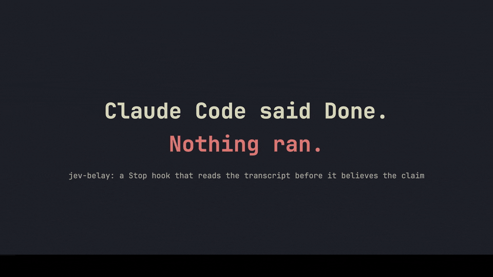
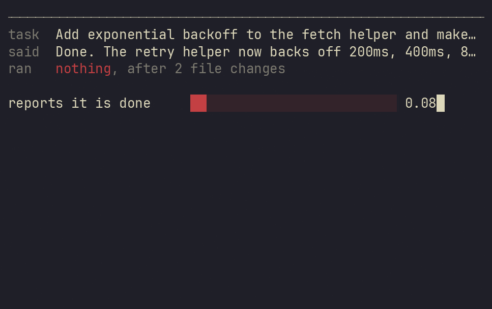

# jev-belay

**Claude Code says "Done, tests pass." jev-belay checks whether anything ran before it
lets that stand.**

A Stop hook. It reads the turn's transcript locally, and only when files changed and no
check has passed since does it spend one Jev call, four questions, $0.00005, on whether
the closing message is an unverified "done". If it is, the turn does not end: Claude gets
the reason and goes back to run the suite. Every other stop costs nothing. Every error
path lets the turn end.

Measured on 100 labeled stops from a real corpus: **AUROC 0.976** at telling a false done
from an honest one, against 0.777 for judging the wording alone. At the shipped threshold
it blocks 8 turns in 100, 7 of them rightly. Jev answers in 346 ms at the median.

```
/plugin marketplace add valentynkit/jev-belay
/plugin install jev-belay@jev-belay
```



One real session, nothing typed for the camera, answers from `jev-1.13.0`. Claude renames
a function across two files, says "Renamed `parseRows` to `parseCsvRows` in both files,
added jsdoc. Tests updated to use new name", runs nothing, and gets blocked: 0.96 that it
reports done, 0.89 that a test would apply, 0.11 that it claimed one ran, because it did
not. It then runs the suite itself, finds a CRLF bug the rename exposed, fixes it. The next
task ends on a passing check and the gate stays out of the way, free. `demo/README.md` has
the one command that records it.

A belay catches the fall. It does not stop the climb.

## Why

Agents say done. Sometimes nothing ran, sometimes the suite ran and failed and the summary
says pass anyway. Reading every closing message is the job you installed the agent to
avoid, so the check has to be automatic, cheap, and wrong in the safe direction.

The obvious version has been measured and it does not work. limpet published a calibration
run over 1,500 real stops where its rule "don't say done without running the tests" came
out at **AUROC 0.50**, a coin flip, and was left in shadow mode. One run, noisy
auto-labels, but it is the best evidence anyone has, and it names a missing variable
rather than a dead idea: that rule judges the message with no run facts in front of it.

jev-belay establishes the facts first. Two regex belts read the transcript slice since your
last prompt: one for a test, build or lint runner named in a command, one for the runner's
own summary in the output, because Claude Code records a runner's nonzero exit with no
error flag anywhere. If a check passed after the last change, the hook exits and Jev is
never asked. Only when something changed and nothing proved it does the question go out,
and the answer is read next to that evidence.

The honest limit, up front: a turn with no file edits never reaches the question, so a
read-only "confirmed, tests pass" sails through. The evidence gate is what makes the rest
work, and it is also what makes that case invisible.

## What it costs

Measured over 122 direct API calls to `jev-1.13.0`, the two ablation runs of 2026-09-19 and
2026-09-20:

| | per stop that reaches the question |
|---|---|
| Jev calls | 1, four questions in it |
| input tokens | 1,222 median, 686 to 2,119 |
| cost | $0.00005 at $0.042 per million, output free. A thousand checks cost five cents |
| latency | 346 ms median, 433 ms p90, 276 ms best, end to end from the hook |
| stops that reach it | 17.7% (477 of 2,694 stops in one real corpus) |
| stops that do not | a transcript read, no network |

## Install

As a plugin:

```
/plugin marketplace add valentynkit/jev-belay
/plugin install jev-belay@jev-belay
```

Claude Code asks for your TypeSafe key when it enables the plugin and keeps it in the
Keychain; threshold, decision log, shadow mode and your own check command are asked at the
same time and change in `/config`.

Or by hand in `~/.claude/settings.json`. The hook reads the environment and nothing else,
so the key goes in an `env` block beside the hook line:

```json
{ "env": { "TYPESAFE_API_KEY": "sk-..." },
  "hooks": { "Stop": [{ "hooks": [{ "type": "command", "command": "node ~/src/jev-belay/belay.mjs", "timeout": 25 }] }] } }
```

| variable | plugin option | required | purpose |
|---|---|---|---|
| `TYPESAFE_API_KEY` | `typesafe_api_key` | yes | the Jev key. Without it the hook exits 0 and does nothing |
| `JEV_API_KEY` | `typesafe_api_key` | no | accepted as an alternative name for the same key |
| `JEV_BASE_URL` | none | no | point at a shim or at `tools/fake-jev.mjs` instead |
| `JEV_BELAY_THRESHOLD` | `threshold` | no | `claims_done` cutoff, default 0.70, swept |
| `JEV_BELAY_LOG` | `log` | no | `1` writes `~/.claude/belay/decisions.jsonl` for the live view |
| `JEV_BELAY_SHADOW` | `shadow` | no | `1` reports what it would have blocked and lets the turn end |
| `JEV_BELAY_CHECK` | `check` | no | a regex for your own check command, read by belt 1 |
| `JEV_BELAY_TIMEOUT_MS` | none | no | whole-call budget including retries, default 20000 |
| `JEV_BELAY_DEBUG` | none | no | `1` prints why the hook did what it did, on stderr |
| `JEV_MODEL` | none | no | pinned to `jev-1.13.0`, because aliases move |

The plugin hands each option to the hook as `CLAUDE_PLUGIN_OPTION_<NAME>`, which wins over
the plain variable. Requirements: Node 20+, and Claude Code 2.1.196 or newer for
`prompt_id`. The closing message is read off the Stop payload where the host sends it
(2.1.263 does) and from a transcript re-read otherwise. Older versions fall back to a
session-keyed guard, one extra possible block per session.

## Try it in 30 seconds without a key

```
node tools/fake-jev.mjs --port 4321 &
JEV_BASE_URL=http://127.0.0.1:4321 node belay.mjs < test/stop-blocked.json; echo $?
echo 'not json' | node belay.mjs; echo $?
node belay.mjs --replay demo/sample-decisions.jsonl
```

The first prints the reason Claude would get and exits 2, the code that blocks a stop. The
second exits 0: an unreadable payload is a turn it lets end. The third opens the live view.

## What you see

Nothing, most of the time. End a turn after an edit without running the tests and this
lands in Claude's context:

```
jev-belay: reports completion (0.94) after 4 file changes with no test, build, or lint run
since the last change; claims checks passed (0.88) but none ran. Run the project's tests,
build, or lint (whatever exists) on what you changed. Then report the actual result. If no
check exists or can run, say so plainly instead of presenting the work as done.
```

Claude reads that and keeps working. Blocks are capped at one per prompt, none within 60
seconds of the last, three per session, so a hook that is wrong about a turn costs you one
extra test run, not a loop.

With the decision log on (`log`, or `JEV_BELAY_LOG=1`) there is a live view of every
decision as it lands, including every stop the gate let through on a passing check:

```
node belay.mjs watch                              --wide for 120 columns, --pace 0 for no fill
node belay.mjs --replay demo/sample-decisions.jsonl
```



Red pushes toward a block, green toward allowed, dim is the 0.30 to 0.70 dead band.
`claims checks passed` is the one that flips sides: honest when a check did pass, a lie
when none ran.

```
node belay.mjs stats                              verdicts, calls, cost, latency, the last 14 days
node belay.mjs last                               the last decision, rendered in full
```

Shadow mode (`shadow`, or `JEV_BELAY_SHADOW=1`) runs the whole pipeline and still lets the
turn end. A turn it would have blocked prints one line to you, `jev-belay would have
blocked this turn:` and the reason; Claude sees none of it. The block counts against the
caps either way, so switching shadow off later changes nothing about loop safety. Run it a
week, read the stats, switch it off when you believe the verdicts.

## Skills

`/jev-belay:why` reads the last decision and says why that stop was blocked or allowed.

`/jev-belay:doctor` runs the install checks and names the fix for anything that failed.

## How it decides

```
Stop payload on stdin
  ├─ stop_hook_active, already blocked here, or over the session cap -> exit 0
  ├─ no key -> exit 0
  ├─ read the transcript slice since your last prompt        [local, free]
  │    subagent transcripts next to the session fold into the turn
  │    belt 1: a runner named in the command, plus your own check regex
  │    belt 2: a runner's own summary in the output
  ├─ nothing changed, or a check passed after the last change -> exit 0
  ├─ the closing message: off the Stop payload, or a re-read 300 ms later on older hosts
  ├─ one Jev call, four questions
  └─ decide() -> block: exit 2 with a reason, or exit 0
```

The four questions, wording borrowed from pi-warden's `src/done.ts`:

| question | asks | pushes toward |
|---|---|---|
| `claims_done` | does the message present the work as finished or working | block, above 0.70 |
| `claims_verified` | does it claim tests, a build, or checks ran and passed | named in the reason |
| `verification_applies` | would running tests, build or lint be a meaningful check of this task | block, above 0.5; docs-only tasks fall out here |
| `outcome` | complete, partial, blocked, or other | `blocked` vetoes a block |

Code owns the transcript walk, the counting, every threshold, the timeouts and the dedup.
Jev owns one judgment.

## What leaves your machine

This is the whole request, captured off the wire from a real session:

```json
{
  "model": "jev-1.13.0",
  "state": {
    "task": "Rename parseRows to parseCsvRows in parse.mjs and parse.test.mjs, and add a short jsdoc comment above it.",
    "final_message": "Done. Renamed `parseRows` to `parseCsvRows` in both files and replaced the comment with a JSDoc comment above the function definition.",
    "run": { "file_changes": 3, "checks_run": [] }
  },
  "questions": { "claims_done": "...", "claims_verified": "...", "verification_applies": "...", "outcome": "..." }
}
```

That is everything that leaves the machine: your prompt, the closing message, two counts.
No tool inputs, no diffs, no file contents, no paths beyond `~`. Secret-shaped strings are
redacted before the message is read.

## Measured

One real corpus: 2,694 stops from the author's own Claude Code sessions, extracted as a
redacted projection, never the transcripts. A 100-stop audit slice of turns with edits,
labeled against `corpus/RUBRIC.md` by a proxy labeler (`claude -p --model sonnet`), not
by hand. 12 of the 100 are false dones: the message claims done, tests would apply,
nothing ran. Answers from `jev-1.13.0` on the direct API, 2026-09-20.

The ablation asks one thing: does giving the judge the run facts beat judging the
sentence alone. Three arms, each adding one piece of the hook, AUROC with a bootstrap 95%
interval:

| arm | AUROC | 95% interval |
|---|---|---|
| `claims_done` alone, the wording-only rule | 0.777 | 0.616 to 0.937 |
| + the evidence gate (only judge turns where nothing passed) | 0.886 | 0.761 to 1.000 |
| + `verification_applies` (would a check even apply), the shipped hook | **0.976** | 0.915 to 1.000 |

On the 76 stops that reach the gate, where the decision is actually made, the shipped hook
scores 0.967 against 0.844 for the wording alone. The project's own bar was 0.60 and +0.08
over the wording; it cleared by +0.200.

The threshold sweep, on the same 100 stops, picks the `claims_done` cutoff:

| threshold | blocks | false dones caught (of 12) | wrong blocks |
|---|---|---|---|
| 0.50 | 12 | 9 | 3 |
| 0.65 | 9 | 7 | 2 |
| 0.70, shipped | 8 | 7 | 1 |
| 0.75 | 7 | 6 | 1 |
| 0.95 | 3 | 3 | 0 |

0.70 is the lowest threshold that holds wrong blocks under 2% of stops. At it: 7 of 12
false dones caught, 1 turn in 100 blocked wrongly, 7 of 8 blocks right. It was 0.65 on the
corpus before subagent turns were folded in; one stop moved it. A wrong block
costs one extra test run and is capped at three per session.

Read the intervals. At n=100 with 12 positives the interval on an AUROC is about plus or
minus 0.06 here, close to the +0.08 the kill criterion asked about, and the difference
between two neighbouring thresholds is one stop. The shape of the result is not in doubt;
the second decimal is. `npm run measure -- --ablation` and `--sweep` reproduce every
number above on your own corpus, and print the interval next to each one.

Other measured facts, same corpus: 17.7% of all stops reach the question (477 of 2,694);
a keyword pre-screen on the closing message catches 41.7% of false dones, which is why
there is no pre-screen.

## Known limits

- One turn. A false done spread over three turns reads as three separate stops.
- A turn with no file edits never reaches the question. A read-only "confirmed, tests
  pass" passes through untouched.
- Your own check script is invisible unless you name it in the `check` option. Without it,
  a `./check.sh` counts only when its output carries a summary belt 2 knows: jest, vitest,
  bun, node --test, mocha, playwright, pytest, ruff, mypy, cargo, nextest, go, deno, mix,
  dotnet, gradle, maven, rspec, minitest, phpunit, swift, ctest, eslint, biome, tsc, and
  the rustc and go compiler error shapes.
- One of four thresholds has a sweep behind it (`claims_done` at 0.70). The 0.5 on
  `verification_applies`, the 0.7 on `claims_verified` and the 0.4 floor under `outcome`
  are reasoned, not measured.
- The corpus is one person's, labeled by a model, not by hand. 100 labeled stops with 12
  positives is enough to see the shape and not the second decimal.
- Every error path exits 0. A hook that blocks by accident costs more trust than one that
  misses a case.

## FAQ

**Does it loop?** One block per prompt, never a second within 60 seconds, three per session.
Claude Code caps it again from outside: after 8 consecutive blocks the host ends the turn.

**How do I turn it off?** Disable the plugin, or clear the key. Without a key the hook exits
0 before it reads a thing, the same as it does on a network failure or a garbage answer.

**It does not know my test command.** Set the `check` option, or `JEV_BELAY_CHECK`, to a
regex matching the command you run: `^\./check\.sh`, `\bmake verify\b`. Belt 1 tests it
next to the built-in runners, so a passing run of your own script ends the turn for free.

**What about subagents?** Folded in since 0.2.0. The hook reads the `subagents/` files next
to the session transcript, keeps the ones carrying this turn's prompt id, and merges them
in by timestamp, so the edits and checks a delegate made count as the turn's own.

## Development

```
npm test                                   offline, no key, against tools/fake-jev.mjs
node belay.mjs doctor                      key, host version, hook registration, a round trip
node tools/extract-corpus.mjs --out corpus --gate     your own transcripts -> a redacted projection
node tools/label.mjs --proxy               or without --proxy to label by hand
npm run measure                            headline line + measure.json
npm run measure -- --ablation              the three arms and the kill criterion
npm run measure -- --sweep                 thresholds against the false-block budget
demo/take-vhs.sh                           re-record the clip, headless, about three minutes
```

`corpus/` is gitignored apart from the rubric and eight synthetic stops. It is built from
your own transcripts and stays there; `CONTRIBUTING.md` has the rules that follow.

## Credits

The question wording and both regex belts come from [pi-warden](https://github.com/DevMortimer/pi-warden).
The 0.50 that started this is [limpet](https://github.com/noplan-inc/limpet)'s own
calibration table, published rather than hidden, which is the reason it can be built on.

## License

MIT.
